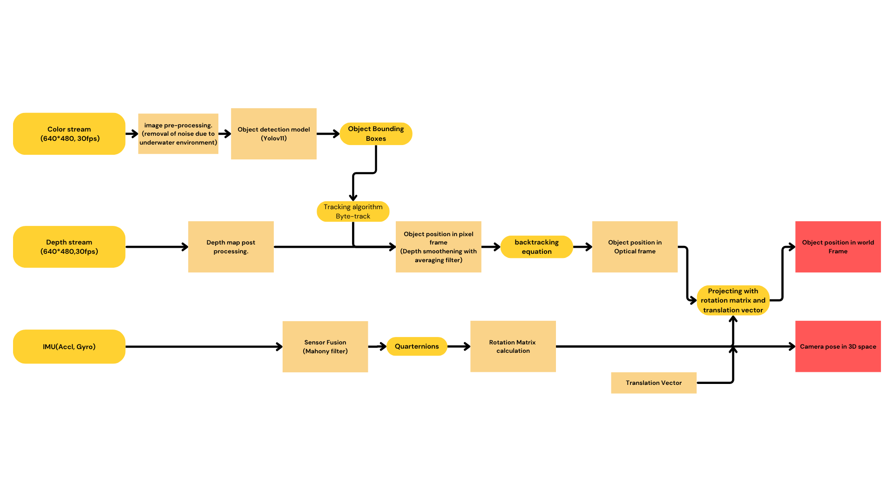
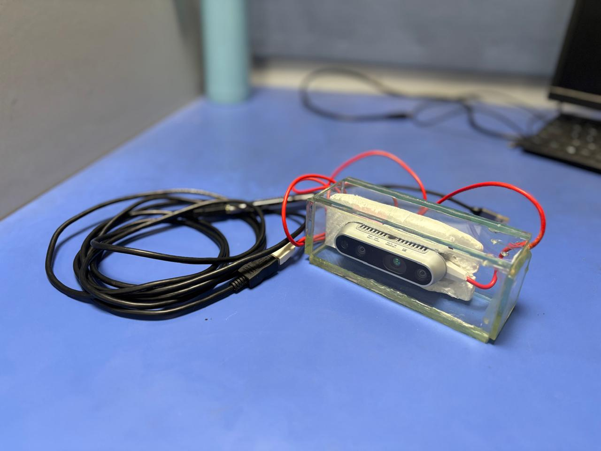

<h1 align="center">
   Real-time Algorithm Development for Underwater Bot detection and Localization
</h1>

  Image processing | 3D reconstruction | Object detection | Sensor Fusion

This is a repository for the project "Real-time Algorithm Development for Underwater Bot detection and Localization" done by Jithu J as the final year thesis project for the course M.Tech in Signal Processing and Machine Learning from IIT Guwahati. As part of the project requirement an Underwater Objects Dataset and a video processing pipeline is developed. An overview of the project is given below, for more details view the project report attached.

**Dataset**

  No of images: 5149

  No of classes: 5

  (most images are locally acquired)

**Data Flow in the pipeline.**

**Underwater Setup for video acquisition.**

For the testing video of the pipeline please visit the following Link:
https://www.youtube.com/watch?v=ubV61sf807c
